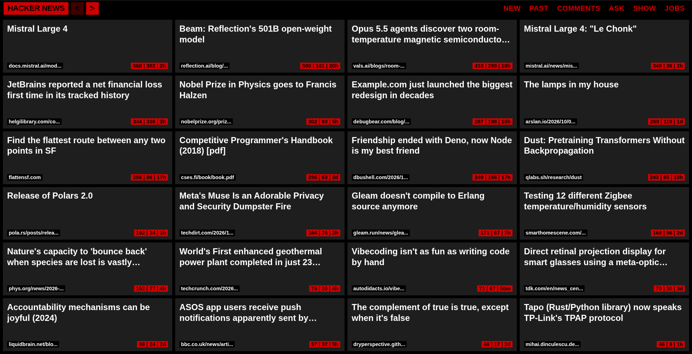
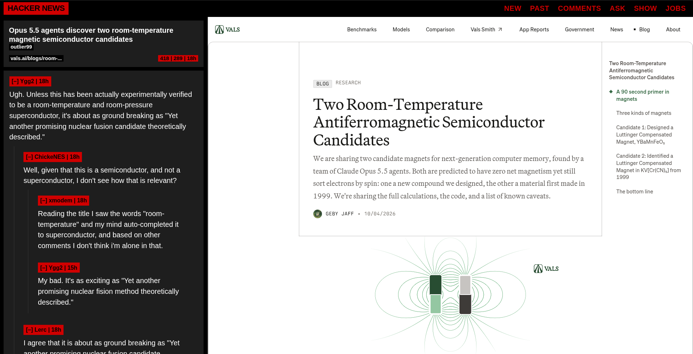

A minimalist, high-density OLED dark interface replacement for Hacker News with embedded side-by-side article previewing and collapsible comment threads.

> This is a **strict read-only / view-only reader**. It removes all account dependencies, logging in, voting controls, comment forms, and submission buttons for a pure, distraction-free consumption experience.

<table>
  <tr>
    <td width="50%"><b>Home Screen</b></td>
    <td width="50%"><b>Post Reader</b></td>
  </tr>
  <tr>
    <td></td>
    <td></td>
  </tr>
</table>

### Features
- **Read-Only Focus**: Built strictly for fast reading. No voting buttons, reply forms, user login, or submission clutter.
- **OLED Dark Theme**: Pure black background with brutalist look.
- **24-Card Dense Grid**: Home screen displays posts in a 4-column × 6-row grid with matching post title sizes, domain badges, and metadata tags.
- **Side-by-Side Split View**: Opening a thread loads the comment sidebar (30%) alongside an embedded live preview (70%) of the linked article. No tab switching required.
- **Bypass X-Frame-Options**: Uses Manifest V3 `declarativeNetRequest` rules to safely render external articles inside the iframe view.
- **Interactive Collapsible Comments**: Click any commenter's badge to collapse or expand nested comment threads with dynamic `[–]` / `[+]` indicators.
- **Header Navigation**: Minimal top bar featuring category filters (`NEW`, `PAST`, `COMMENTS`, `ASK`, `SHOW`, `JOBS`) and `<` / `>` pagination buttons.

### Installation
1. Clone or download this repository.
2. Open `chrome://extensions` in any Chromium-based browser (Chrome, Brave, Edge).
3. Enable **Developer mode** (toggle in the top-right corner).
4. Click **Load unpacked** and select the project directory.